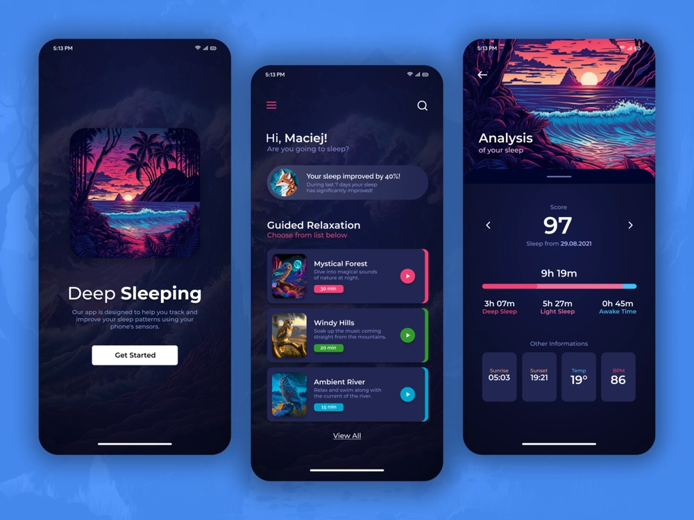

Even though I'm mainly interested in frontend and backend development, from time to time, I like to create some UI/UX, for someone on request or just for fun.

This time I've came up with a list of UI ideas for the Daily UI challenge for the next 7 days. Here is the list:
- Meditation app landing page
- Healthcare mobile app
- Project management tool dashboard
- Fictional online course platform
- Tracking and analyzing sleep mobile app
- Local bakery website
- Travel agency website

Each day I created one graphic design and published as a shot on [**Dribbble**](https://dribbble.com/maciejb). I'd like to invite everyone to my [**Dribbble**](https://dribbble.com/maciejb), I'll be publishing my future works there. 

Here are the results of the Daily UI challenge:

