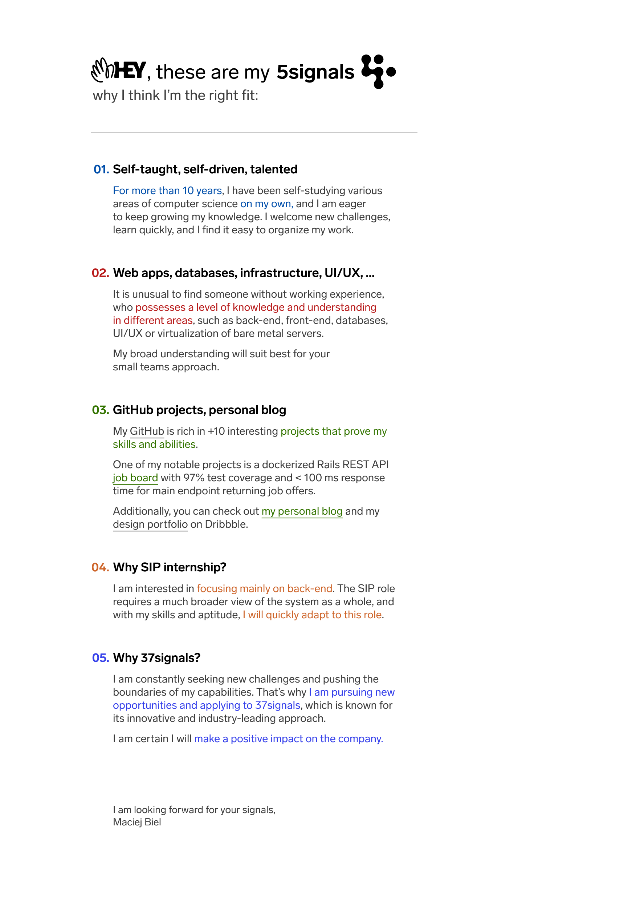

## TL;DR

Unfortunately, I wasn't selected for the SIP Programming Internship, but I managed to get into the **top 3 final candidates among +2000** and **pass all recruitment stages.**

It was an interesting experience. I learned a lot, and I'm proud of myself for making it this far.

## How it started

In the Rails community, **37signals** is a well-known company. They are the creators of Basecamp and Hey, and the co-founder and CTO, [David Heinemeier Hansson](https://twitter.com/dhh), is the creator of the Ruby on Rails framework.

When I saw the [internship offer](https://startup.jobs/internships-summer-23-37signals-4038698) in January, I immediately started researching the company. The internship offers from them come once in a few years, so it was a very unique opportunity.

I looked through their websites ([37signals](https://37signals.com/), [Basecamp](https://basecamp.com/), [HEY](https://www.hey.com/)), [Twitter](https://twitter.com/dhh), [YouTube](https://www.youtube.com/@basecamp), blogs ([Hey World](https://world.hey.com/dhh), [Signal v. Noise](https://m.signalvnoise.com/), etc.), podcast ([Rework](https://37signals.com/podcast/)), and their books ([Basecamp Handbook](https://basecamp.com/handbook), [Shape-Up](https://basecamp.com/shapeup), [Getting Real](https://basecamp.com/gettingreal)) to figure out the best way to write my resume and cover letter to maximize my chances of getting in.

When I was looking through Twitter, I saw that when a job offer opens up at 37signals, the recruiting team usually manually goes through thousands of applications.

They were looking for three interns for their **Web Programming** team, **SIP** (Security, Infrastructure, and Performance) team, and **Ops** team. I applied for the SIP team because I am mainly interested in focusing on the backend.

The recruitment process consisted of three stages: an introductory call, a coding task, and a technical interview. At each of these stages, some people were eliminated.

I knew I was taking on a very difficult challenge, but I felt like I could do it.

## Resume & Cover Letter

They have repeatedly emphasized on their website and podcast that [they don't look at the resume](https://www.youtube.com/shorts/SUrp_6HN_qM) and the cover letter is what matters the most to them. That's why I spent the most time on it.

The reason for this is that most of their communication is done through writing, there aren't many meetings and they don't get in person very often ([37signals is a fully remote and fully async company](https://basecamp.com/handbook/09-how-we-work#asynchronously)). That's why the ability to write and explain yourself very clearly by writing and thinking out loud is crucial.

Therefore, the cover letter is the most important to them because it can show a lot about a person, such as how they communicate and present themselves.

It took me two weeks to create a cover letter and resume. When creating my cover letter, I aimed for maximum simplicity and conciseness while also trying to include as much content as possible.

I assumed that the recruiter would spend at most 1-2 seconds looking at my cover letter, so I had to somehow grab their attention. My goal was to make sure that the content I wanted to convey could be easily understood within a few seconds.

Here is my cover letter:

  

## Introductory call

At the end of February (27.02.2023), I received an email from the recruiting team saying that I was **selected for an introductory call**. I was surprised because I didn't expect to get invited to the next stage of the recruitment process.

I scheduled the call with a recruiter at 21:30 (CET) on March 9th, 2023. There was a calendar with two weeks of available slots, so I had to choose the best time for me.

We were talking with the recruiter for about 30 minutes. I was asked about what brought me to the company, what is my biggest achievement, how I deal with conflicts, and what are my questions about the company.

I was satisfied with the interview, the recruiter was very nice and we had a good conversation.

I was preparing for this call for one and a half week, I took a lot of notes with possible questions and answers.

I was also very unhappy with the call because I felt that my English level downgraded to the most basic level. I was stuttering, I couldn't find the right words, I was talking too fast, and I was making a lot of mistakes. As a Polish person, I'm not used to speaking English on daily basis, and I was very nervous.

During the call, I asked the recruiter about the number of candidates, and she said that **there were over 2000 applications**, and to that point, they invited only 70 people. I was very happy to hear that because I thought that I had a very small chance of getting in.

## Coding test

The day I scheduled the introductory call was the last day of introductory calls. The next day, I received an email that I had successfully passed the introductory call and I was invited to the next stage, which was the coding test.

The coding test was to **add support for importing contacts from vCard files** to the basic Rails 7 application, which was already prepared for me in a GitHub repository.

I had to create a form that would allow the user to upload a vCard file, handle the file upload, find a gem for parsing vCards, parse the file, and save the contacts to the database. I had to assume, that contacts must be unique by email address. I had to provide feedback to the user about the import process. Also, they asked to add some tests.

I had one week to complete the task (from 13th March 2023 to 19th March 2023) and to open a pull request with my solution.

I've done my task within five days. If the time to complete the task was narrowed down to just 2 days, I would do it in two days, I just wouldn't go to university. I met all the requirements, and I also added some extra features, such as importing only part of the contacts from the file, which were not already in the database.

In the beginning, I was surprised, because I applied for the SIP role, and I was expecting some hard tasks with Redis, MySQL, maybe Docker, task queues, rate limiting, etc. I was expecting something very hard, and I was prepared for the worst.

## Final interview

On March 23rd, I received a message that **I had passed to the final stage**, which was a **technical interview** with the Director of Engineering and the Engineering Manager of the SIP team.

After receiving this message, I knew that it was a serious matter and that I had to prepare as best as I could, especially since it was going to be a technical interview, as stated in the job offer.

I had one week to prepare. I made a lot of notes again and refreshed my technical knowledge, both theoretical and practical.

The final interview lasted for 50 minutes and consisted of two parts: **talking about my solution to the coding task** and some **general questions**, like what I will bring to the company, what areas should I improve, whether am I ok with working fully remotely, etc. After that, I had time to ask them some questions.

In the beginning, they asked me questions about my code to verify if I was the actual author, which was a positive thing (for example, why did I choose this gem for parsing vCards, why did I set up a unique index in the database and email validation in the model, why did I add a separate gem for bulk insertion, why did I validate this content type for vCard and not another, mentioned in required RFC in the task description).

They mentioned in the job offer, that they are avoiding some brainteasers, whiteboards, or gotchas during technical interviews, but during the conversation, I was surprised that they didn't ask me about any technical things, those that I was prepared for (programming, oop, data structures, computer networks, plain Ruby, databases, git, frontend, infrastructure, security). Instead, the technical questions were only related to my code and my decisions on why I chose such solutions in the code.

The coding task was diverse and certainly showed a way of thinking, and maybe that was all they needed. However, as a candidate, you could have not known anything beyond the selected code parts during the interview and still pass this stage of the recruitment process.

## Conclusions

On April 4th I received an email that **I was not selected for the internship**. I was very disappointed, but I knew that I did my best and I could not do anything more.

I am happy with the entire hiring process, which went smoothly and without any problems. Completing the coding task was fun, and I want to thank everyone who was involved for their time and consideration of my application.

To be honest, I still don't know if I did my recruitment task well or not. Perhaps I overengineered my solution or I didn't do it well enough.

I created a basic working version of the code within one day. Since there was plenty of time, later on, I played around with the code a bit, refactoring it, adding tests, features, and so on. I can assume that they didn't like that I spent a lot of time on this task.

I think that my English level and communication skills presented during the final interview were one of the main reasons why I wasn't selected. Being very nervous made it hard for me to concentrate and speak clearly.

While I hadn't any trouble understanding the Director of Engineers, the conversation with the SIP team Engineering Manager was probably the most difficult I've ever had, due to his accent, random microphone cuts, and random Zoom lags (that's why I hate talking on platforms other than Discord - the voice quality and stability is incomparable). I want to make it clear that I have no issue with him personally. It was my job to understand him. I need to greatly improve my English skills, especially my listening skills.

My conclusion is that I need to start learning and improving even more, as my current level wasn't enough to secure the internship. I also need to avoid making similar mistakes in the future.
