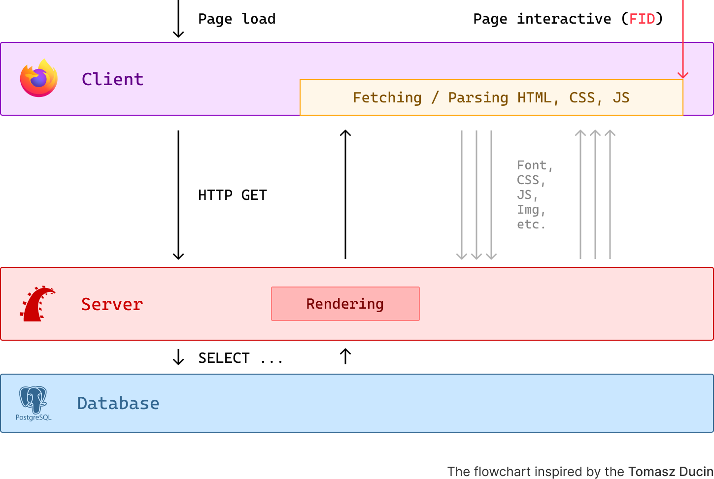
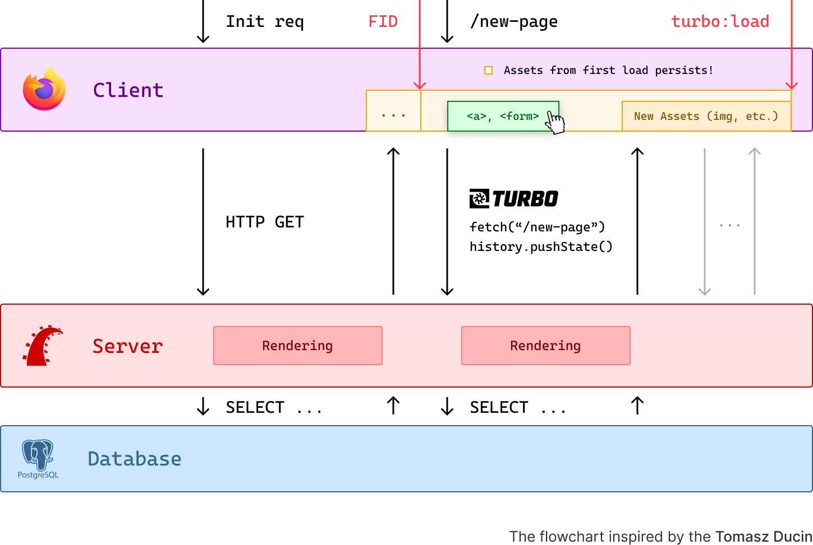
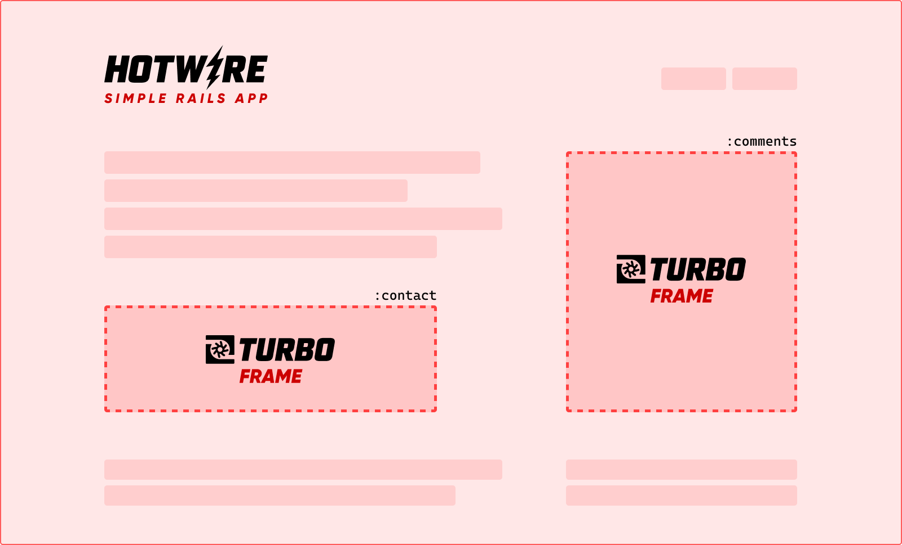
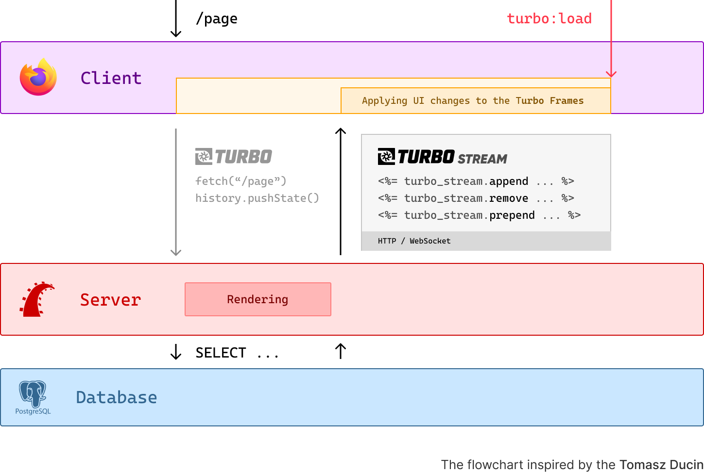
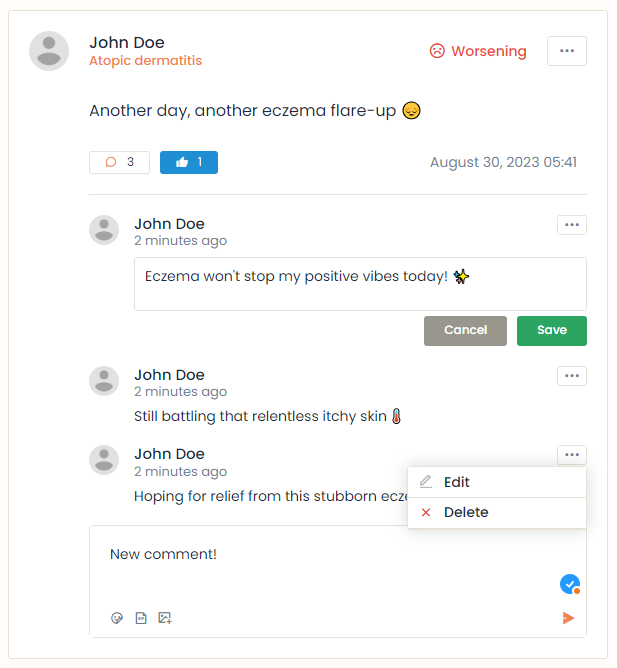
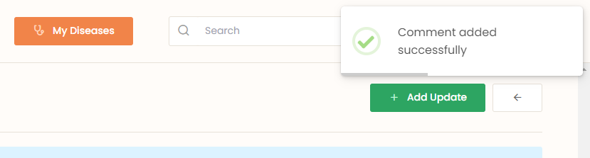

I started using Turbo with Rails half a year ago. I implemented Turbo in two of my projects (side and commercial one) and I have some initial thoughts about it.

## Multi Page Applications

To better understand <b>what problems Turbo solves</b>, let's assume we have a web application with single codebase, where backend and frontend are tightly coupled like Rails with ERB views, Laravel with Blades, Django with Django Templates etc.

With every request, a full page reload is performed by the browser, and an entirely new HTML page is sent back by the server. The browser then proceeds to parse it and subsequently fetches resources like CSS, JS, images, etc.

On each reload/refresh, the page is destroyed, the process on the flowchart is repeated and the browser fetches the same assets over and over again.

This is the most classic type of web applications called **Multi Page Applications** (MPA).

<br>



<br>


If we want to update only a part of the page or add some interactivity, we need to write some custom JavaScript code to fetch the data (previously known as AJAX) and update the DOM, which leads to a lot of extra code and work for the developer.

## What Turbo is?

<br>


<br>


The frontend in **Rails** from version 7 is closely integrated with three JavaScript libraries: [**Turbo**](https://turbo.hotwired.dev/), [**Stimulus**](https://stimulus.hotwired.dev/) and [**Strada**](https://strada.hotwired.dev/), which all combined are called [**Hotwire**](https://hotwired.dev/). They are developed and maintained by [37signals](https://dev.37signals.com/).

**Turbo** is a small and simple JavaScipt library, which consists of three major parts.

### Turbo Drive

[Turbo Drive](https://turbo.hotwired.dev/handbook/drive) is a main part of Turbo. Take a look at the flowchart below.

<br>



<br>

When the Turbo script is loaded on the first request, Turbo Drive **intercepts** all clicks on `<a>` links to the same domain and all `<form>` submissions.

Now, every time when we click on a link or submit a form, instead of performing full page reload, the Turbo:
- Requests the new page using `fetch()` ([Fetch API](https://developer.mozilla.org/en-US/docs/Web/API/Fetch_API)) and displays [progress bar](https://turbo.hotwired.dev/handbook/drive#displaying-progress) on the current page.
- Changes the URL in the browser using [History API](https://developer.mozilla.org/en-US/docs/Web/API/History_API).
- Replaces the current `<body>` with response and merges `<head>`.

This is a noticable **performance improvement**, because we download the necessary assets for every page like css, js, fonts, etc. **only once** on the first request. The server and client are not doing the same work over and over again.

Browsing **GitHub repositories** is a great example of a Turbo Drive in action (btw. did you know that [GitHub is a monolith Rails application](https://github.blog/2023-04-06-building-github-with-ruby-and-rails/)?).

### Turbo Frames

[Turbo Frames](https://turbo.hotwired.dev/handbook/frames) are related to the client side.

When using Turbo Drive, by default it replaces the entire `<body>` with each response. We are not limited to this behavior, because thanks to Turbo Frames we can:
- Decompose our page and **replace smaller parts of the page** wrapped with frames.
- Defer **load of a page** from our application inside the frame.

<br>



<br>

Turbo uses custom HTML element `<turbo-frame>` to define a frame.
```html
<turbo-frame id="contact">
  ...
</turbo-frame>

<turbo-frame id="comments" src="/comments">
  <p>Loading comments ...</p>
</turbo-frame>
```

ERB syntax example.
```ruby
<%= turbo_frame_tag :comments, src: comments_path(@post) do %>
  <%= t(".loading") %>
<% end %>
```

It all comes down to the **IDs** from the **DOM**.

Each DOM element must have a **unique ID**. If the ID matches with the ID of Turbo Frame from server response, some actions by Turbo can be performed, like replacing or appending the content (more on actions later).

Turbo offers a wide range of **customizations for Turbo Frames**, whether the whole navigation is again intercepted by Turbo Drive and limited to the frame, so the navigation occurs only inside the frame, not the entire page (browser's history is not affected) or whether we can break out the frame and navigate to the URL outside the frame.

### Turbo Streams

[Turbo Streams](https://turbo.hotwired.dev/handbook/streams) are related to the server side.

Turbo Stream is a **response from the server**, which contains one or more `<turbo-frame>` tags. Consider this as a set of changes to the DOM, which Turbo will perform.

<br>



<br>

Turbo offers seven possible **actions**: `append`, `prepend`, `replace`, `update`, `remove`, `before`, `after`.

#### Turbo Stream in Rails

Let's assume that we have a `SurveysController` controller and we have created a new poll using the `#create` method.

Rails offers a convenient way to respond to different formats. On the client side, Turbo attaches a header `Accept: text/vnd.turbo-stream.html` to the request, so the server can respond to it with a Turbo Stream.
```ruby
# app/controllers/surveys_controller.rb

...

respond_to do |format|
  format.turbo_stream
  format.html do
    redirect_to survey_path, flash: { success: t(".success") }
  end
end
```

This is a Turbo stream template file `create.turbo_stream.erb` with specified actions (Rails app will automatically pick up this template file when responding as a  `turbo_stream`).

The first action will render the form again with optional validation errors. The second action will replace the frame with the reCAPTCHA challange.
```ruby
# app/views/surveys/create.turbo_stream.erb

<%= turbo_stream.replace dom_id(@survey),
                         partial: "form",
                         locals: { model: @survey } %>

<%= turbo_stream.replace 'recaptcha', partial: "challange" %>
```

Below we can see a raw HTTP response from the server. It may contain multiple Turbo Streams with different actions and targets.

On the client side, turbo does the following:
- Looks through the whole server response.
- Matches the turbo stream IDs from response with the IDs from the DOM.
- Performs some actions specified by the server.

Turbo will only render these frames, which match the IDs from the DOM. The rest of the targets from the response will be ignored.
```html
HTTP/1.1 200 OK
Content-Type: text/vnd.turbo-stream.html
...

<!-- Regular HTML -->

<turbo-stream action="replace" target="new_survey">
  <template>
    ...
  </template>
</turbo-stream>

<!-- Regular HTML -->

<turbo-stream action="replace" target="recaptcha">
  <template>
    ...
  </template>
</turbo-stream>
```

#### Broadcasting live updates

Turbo also allows us to broadcast live changes to the multiple subscribers using [Action Cable](https://guides.rubyonrails.org/action_cable_overview.html).

It works the same as previous server response with set of Turbo Stream actions, but instead of responding to the request from the client, the server itself broadcasts the Turbo Stream to all subscribers over the WebSocket connection.

Example Rails Model with callback to broadcast the Turbo Stream.
```ruby
class SurveyOption < ApplicationRecord
  ...
  after_create_commit -> {
    broadcast_append_to(
      "survey_options",
      partial: "survey_options/option",
      locals: { option: self },
      target: "survey_options"
    )
  }
  ...
end
```

### More on Turbo

All of the libraries from the Hotwire are intended to be framework agnostic, but they work best with **Rails**. Moreover, most of the tutorials and examples are suited for Rails.

This is only brief explanation of how Turbo works. For detailed explanation and deep dive, check out [documentation](https://turbo.hotwired.dev/handbook/introduction), [this article](https://www.writesoftwarewell.com/turbo-drive-essentials/) and [this guide](https://www.hotrails.dev/turbo-rails).

## What I like about Turbo?

### Single Codebase

**We don't need to write a separate frontend application**. This is the most important strength of Turbo combined with other libraries from Hotwire.

Turbo **works out of the box** with new and existing Rails applications and requires very little configuration. Is significantly **saves a lot of time** and reduces effort for the developer or the team.

It also may save a lot of money for the client, because we don't need to hire a separate frontend developers - a few backend developers can do the same job (of course, if they like to get hands dirty with CSS).

###  Less JavaScript

Turbo **reduces amounts of JavaScript code**, because we don't need to write custom code for fetching data and updating the DOM. Sometimes it is necessary to write some custom JavaScript code, but the [**Stimulus**](https://stimulus.hotwired.dev/) framework is designed to solve this problem. It works very well with Turbo.

### Maintainability

Single codebase also leads to easier **maintenance** and **deployment** of the application. We don't need to worry about lots of the outdated NPM packages and other dependencies in the frontend application after some time.

### Interactivity

Turbo allows us to create a web application, which may kinda feel like SPA, but without the complexity of the SPA. This is not easy to achieve and requires some skill and experience with the frontend, Turbo and Rails, but it is possible and can be done.

As an example I will show you a piece from my side project, where in the user posts, I was able to implement infinite scrolling, likes, adding, editing and deleting comments without full page reload.

Without Turbo or some javascript framework, this would be impossible to implement.

<br>



<br>

With a little help of Stimulus, I can even trigger toast messages from the server side, which feels like SPA. This is actually very cool.

<br>



<br>


`create.turbo_stream.erb`
```ruby
...

<%= turbo_stream.update :dash_toast,
                        partial: "shared/dash_toast",
                        locals: {
                          message: t(".toast.success"),
                          icon: "success"
                        } %>
```

`app/views/shared/_dash_toast.html.erb`
```ruby
<div
  data-controller="show-toast"
  data-message="<%= message %>"
  data-icon="<%= icon %>">
</div>
```

`app/javascript/controllers/show_toast_controller.js`
```javascript
export default class extends Controller {
  connect() {
    Toast.fire({
      icon: this.element.dataset.icon || "info",
      text: this.element.dataset.message,
    }).then((result) => {
      if (result.isDismissed) {
        this.element.remove();
      }
    });
  }
}
```

### Performance

Turbo **improves performance** of the application, because we don't need to download the same assets over and over again. It also reduces the amount of data transferred over the network.

From my experience, the [web vitals](https://web.dev/articles/vitals?hl=en) like [LCP](https://web.dev/articles/lcp?hl=en), [FID](https://web.dev/articles/fid?hl=en), [CLS](https://web.dev/articles/cls?hl=en) measured by the [PageSpeed Insights](https://pagespeed.web.dev/) or [Lighthouse](https://developer.chrome.com/docs/lighthouse/overview?hl=en) are on a very good level (90+ score on the performance). You can measure these metrics be yourself by testing [HEY](https://www.hey.com/) or [Basecamp](https://basecamp.com/), which are both build with Hotwire.

If there are any problems with frontend performance, it is probably some bad optimization on the backend side, rather than Turbo itself.

Turbo will not be as fast as newest combinations of Next.js with Server Components, SSR and SSG deployed on Vercel, but with efficent optimizations, the core web vitals can be on a very good level.

## What I don't like about Turbo?

### Lack of component libraries

Ecosystems like React, Vue or Angular have a tons of component libraries, which you can very easily intergrate with your application and they speed up the development process a lot.

This is not the case with Hotwire (Turbo + Stimulus). The only reasonable component library is [Stimulus Components](https://www.stimulus-components.com/), which is more like a selective collection of basic components, rather than a full featured component library. You have to often look over the Internet for some custom vanilla js components.

Maybe there are some component libraries for Hotwire, and I am not aware of them, let me know if you know any and I am wrong.

### Learning curve

The concept behind Turbo is simple and documentation is not long to read and understand, but when I was trying to use Turbo at the beginning I was so pissed of how magical it is 😂 and I couldn't move forward becase the unexpected things were happening all the time.

Due to this initial lack of understanding, I've been thinking all the time that Turbo instead of speeding up my work, it's slowing it down twice as much, and I was considering about giving up on it and going back to the SPA with React or Angular.

It took me some time to understand how the Turbo Streams interact with the Turbo Frames and DOM elements, but to be honest, sometimes I am still struggling with it.

But I think this is normal in Rails world. A lot of magic happens at the beginning and it does not speed up the work, but after some practise and experience, it starts to pay off and make things done faster.

### Handling UI mostly by yourself

Turbo gives you only the fundamentals to communicate with the server and update the DOM without writing a lot of custom JavaScript code.

Let's say we want to implement a simple contact form. You have to handle the UI events like disabling the button after submitting the form, displaying flash messages, clearing the form after successful submission, etc. by yourself - on the client and server side.

Dealing with these UI events and changes is easier with form libraries like React Hook Form or Angular Reactive Forms in frontend frameworks, but in Rails we still have an advantage of single codebase and single place to manage the state of the application.

You need to have well-thought-out code and application structure, both in terms of UI and file structure. You also need the skills to navigate through them efficiently.

### Many partials and Stimulus controllers

Working with Turbo leads to extracting a lot of partials for Turbo Streams and creating a lot of Stimulus controllers to control the behavior and clean up the DOM after the Turbo Stream actions.

This may quickly lead to a lot of mess in the code and without proper organization and good understanding of Rails conventions, it may be hard to maintain in the future.

### Overall UX of apps built with Turbo

This is probably topic to discuss, but I have a feeling, that even though apps with Turbo are very close to have SPA-like experience, but they are a little sluggish and these interactions with the user are with a little delay and not as smooth as in SPA.

This may be a skill issue and I am wrong, but a well written app in modern frontend framework feels blazing fast when compared to the app with Turbo.

## Summary

Overall Hotwire with Turbo is very cool alternative approach for modern frontend development, and when working solo as a "Reinassance Developer" this is a ultimate powerful tool.

I like it and I will continue to learn and use it. Hotwire is not a silver bullet and it is not for everyone, but it is worth to try it out when you are working with Rails.
