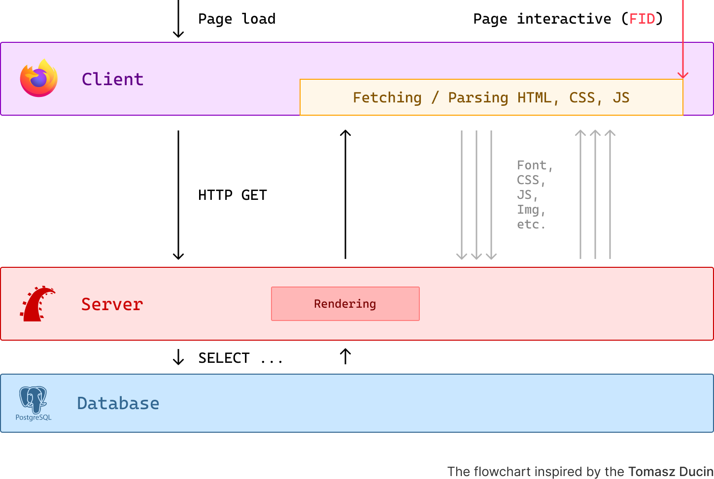

I started using Turbo with Rails half a year ago. I implemented Turbo in two of my projects (side and commercial one) and I have some initial thoughts about it.

## Multi Page Applications

To better understand <b>what problems Turbo solves</b>, let's assume we have a web application with single codebase, where backend and frontend are tightly coupled like Rails with ERB views, Laravel with Blades, Django with Django Templates etc.

With every request, a full page reload is performed by the browser, and an entirely new HTML page is sent back by the server. The browser then proceeds to parse it and subsequently fetches resources like CSS, JS, images, etc.

On each reload/refresh, the page is destroyed, the process on the flowchart is repeated and the browser fetches the same assets over and over again.

This is the most classic type of web applications called **Multi Page Applications** (MPA).

<br>



<br>


If we want to update only a part of the page or add some interactivity, we need to write some custom JavaScript code to fetch the data (previously known as AJAX) and update the DOM, which leads to a lot of extra code and work for the developer.

## What Turbo is?

Turbo is a small and simple JavaScipt library, which consists of three major parts.

### Turbo Drive

Turbo Drive is a main part of Turbo. Take a look at the flowchart below.

<br>


<br>

When the Turbo script is loaded on the first request, Turbo Drive **intercepts** all clicks on `<a>` links to the same domain and all `<form>` submissions.

Now, every time when we click on a link or submit a form, instead of performing full page reload, the Turbo:
- Requests the new page using `fetch()` ([Fetch API](https://developer.mozilla.org/en-US/docs/Web/API/Fetch_API)) and displays [progress bar](https://turbo.hotwired.dev/handbook/drive#displaying-progress) on the current page.
- Changes the URL in the browser using [History API](https://developer.mozilla.org/en-US/docs/Web/API/History_API).
- Replaces the current `<body>` with response and merges `<head>`.

This is a noticable **performance improvement**, because we download the necessary assets for every page like css, js, fonts, etc. **only once** on the first request. The server and client are not doing the same work over and over again.

Browsing **GitHub repositories** is a great example of a Turbo Drive in action (btw. did you know that [GitHub is a monolith Rails application](https://github.blog/2023-04-06-building-github-with-ruby-and-rails/)?).

### Turbo Frames

When using Turbo Drive, by default it replaces the entire `<body>` with each response. We are not limited to this behavior, because thanks to Turbo Frames we can:
- Decompose our page and **replace smaller parts of the page** wrapped with frames.
- Defer **load of a page** from our application inside the frame.

<br>


<br>

Turbo uses custom HTML element `<turbo-frame>` to define a frame.
```html
<turbo-frame id="contact">
  ...
</turbo-frame>

<turbo-frame id="comments" src="/comments">
  <p>Loading comments ...</p>
</turbo-frame>
```

ERB syntax example:
```ruby
<%= turbo_frame_tag :comments, src: comments_path(@post) do %>
  <%= t(".loading") %>
<% end %>
```

It all comes down to the **ID's** from the **DOM**.

Each DOM element must have a **unique ID**. If the ID matches with the ID of Turbo Frame from server response, some actions by Turbo can be performed, like replacing or appending the content (more on actions later).

Turbo offers a wide range of **customizations for Turbo Frames**, whether the whole navigation is again intercepted by Turbo Drive and limited to the frame, so the navigation occurs only inside the frame, not the entire page (browser's history is not affected) or whether we can break out the frame and navigate to the URL outside the frame.

### Turbo Streams

```ruby
<%= turbo_stream.remove "request-#{@friend_request.id}" %>

<%= turbo_stream.update :flash,
                        partial: "shared/dash_flash" %>

<%= turbo_stream.update :outgoing_requests,
                        partial: "friend_requests/outgoing_requests",
                        locals: { outgoing: @outgoing } %>

<%= turbo_stream.update :dash_pagination,
                        partial: "shared/dash_pagination",
                        locals: { pagy: @pagy_outgoing } %>
```

Lorem ipsum dolor sit amet, consectetur adipiscing elit. Donec auctor, nisl eget ultricies ultricies, nunc nisl ultricies nunc, quis ultricies nisl nisl eget nisl. Donec auctor, nisl eget ultricies ultricies, nunc nisl ultricies nunc, quis ultricies nisl nisl eget nisl.

### Hotwire and Rails

The frontend in Rails 7+ is closely integrated with three JavaScript libraries: [**Turbo**](https://turbo.hotwired.dev/), [**Stimulus**](https://stimulus.hotwired.dev/) and [**Strada**](https://strada.hotwired.dev/), which all combined are called [**Hotwire**](https://hotwired.dev/). They are developed and maintained by [37signals](https://dev.37signals.com/).

All of them are intended to be framework agnostic, but they work best with Rails. Moreover, most of the tutorials and examples are suited for Rails.

This is only brief explanation of Turbo, for detailed explanation and deep dive, check out [documentation](https://turbo.hotwired.dev/handbook/introduction), [this article](https://www.writesoftwarewell.com/turbo-drive-essentials/) or [this guide](https://www.hotrails.dev/turbo-rails).