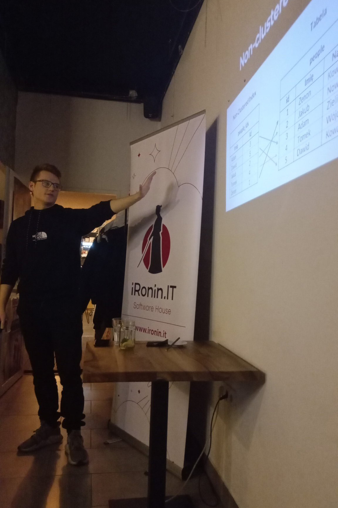

Last Wednesday I had the pleasure of giving a presentation on Indexes in PostgreSQL at the Rzeszow Ruby User Group meeting. It was an interesting experience that allowed me to share my knowledge with the other participants of the meeting. Thank you to the organizers for this opportunity.

Link to RRUG:

https://twitter.com/rrugpl

